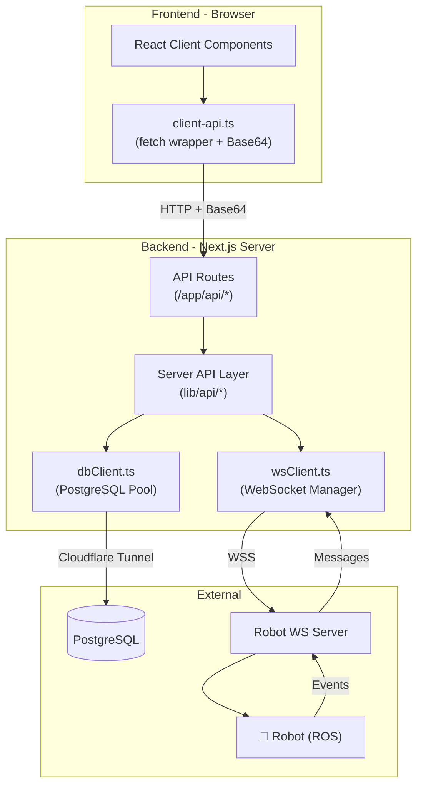
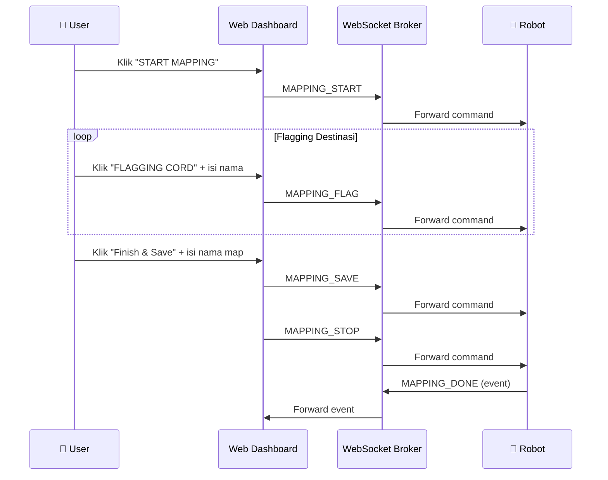
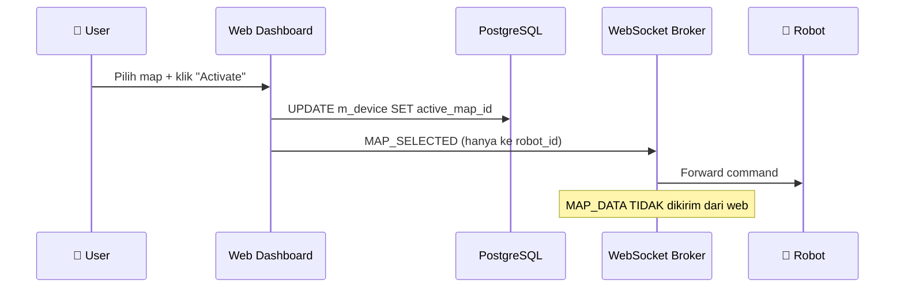
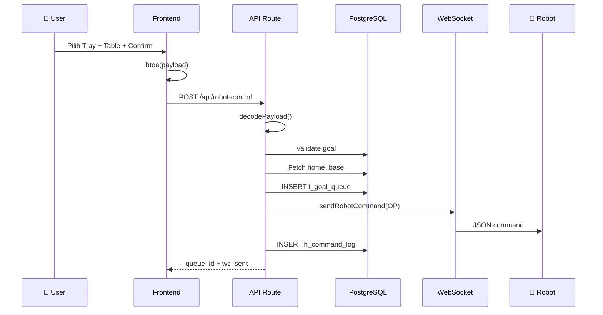

# TIFA Dashboard — Ringkasan Lengkap Program

## Overview

**TIFA Dashboard** adalah web-based monitoring and control system untuk robot TIFA (Tel-U Interactive Food Assistant) yang dikembangkan oleh **Diagonal Robotic**. Dashboard ini memungkinkan operator untuk memantau status armada robot secara real-time, mengirim perintah navigasi ke meja tujuan, mengontrol robot secara manual (teleop), melakukan live mapping, serta mengelola peta dan destinasi.

Sistem dibangun menggunakan **Next.js 16** dengan App Router, **PostgreSQL** sebagai database utama (diakses via Cloudflare Tunnel), dan **WebSocket** untuk komunikasi real-time dengan robot.

---

## 1. Tech Stack

Seluruh konfigurasi dependencies didefinisikan di `package.json`:

- **Framework**: Next.js 16 (App Router) dengan React 19 dan TypeScript 5
- **Styling**: TailwindCSS v4 + PostCSS, font Plus Jakarta Sans dari Google Fonts
- **Database**: PostgreSQL via `pg` package (node-postgres) — koneksi melalui Cloudflare Tunnel ke `postgres.forgixrobotic.com`
- **WebSocket**: `ws` package untuk komunikasi server-side dengan robot broker di `wss://tifa-ws.forgixrobotic.com`
- **Dev Tools**: `concurrently` untuk menjalankan Next.js dev server + cloudflared tunnel secara bersamaan

Environment variables dikonfigurasi di `.env.local` — berisi credentials database (`DB_HOST`, `DB_PORT`, `DB_NAME`, `DB_USER`, `DB_PASS`) dan URL WebSocket (`WS_ROBOT_URL`).

---

## 2. Arsitektur Sistem



Alur komunikasi berjalan satu arah dari frontend ke backend. Semua request dari client components melewati `client-api.ts` yang men-encode payload ke **Base64** sebelum dikirim ke API routes. Backend kemudian men-decode dan meneruskan ke database atau WebSocket sesuai kebutuhan.

> [!IMPORTANT]
> Frontend **tidak pernah** berkomunikasi langsung dengan database atau WebSocket. Semua diproxy melalui Next.js API routes di server-side.

---

## 3. Frontend — Halaman

### Landing Page & Auth

Root layout ada di `app/layout.tsx`, dan landing page Diagonal (company profile) ada di `app/page.tsx`. Halaman ini dilengkapi navbar interaktif (`DiagonalNavbar.tsx`) dengan custom cursor animation.

Auth menggunakan layout group `(auth)/`:
- **Login** di `app/(auth)/login/page.tsx` — centered form tanpa sidebar
- **Register** di `app/(auth)/register/page.tsx` — saat ini **disabled**

### Dashboard

Semua halaman dashboard berada dalam layout group `(dashboard)/` dengan shared layout di `app/(dashboard)/layout.tsx` yang menyediakan sidebar navigasi, header bar, user dropdown, theme/language switcher, dan auth guard (redirect ke `/login` jika belum login).

Halaman-halaman dashboard:

1. **Dashboard Home** — `app/(dashboard)/dashboard/page.tsx`
   Monitoring overview dengan statistik fleet (robot aktif, rata-rata baterai, error count), battery distribution chart, activity logs, dan robot selector modal.

2. **Robot Fleet** — `app/(dashboard)/robots/page.tsx`
   Grid view semua robot yang ter-grouped, menampilkan status online/offline, battery level, mode, IP, dan SSID. Auto-refresh setiap 15 detik.

3. **Robot Detail** — `app/(dashboard)/robots/[id]/page.tsx`
   Terminal per-robot dengan panel kontrol navigasi dan teleop via `RobotControlPanel.tsx`.

4. **Manage Robots** — `app/(dashboard)/robots/manage/page.tsx`
   CRUD robot (device_name, device_code, local_ip, local_ssid).

5. **Manage Maps** — `app/(dashboard)/robots/maps/page.tsx`
   Upload peta (PGM + YAML), kelola destinasi per map, multi-step upload wizard, dan CRUD goals.

6. **Log Activity** — `app/(dashboard)/notifications/page.tsx`
   Riwayat command execution dan WS traffic, dengan filter All/Success/Error.

7. **Account** — `app/(dashboard)/account/page.tsx`
   View profil, change password, account info.

---

## 4. Frontend — Komponen Utama

### Robot Control Panel (`RobotControlPanel.tsx`)

Komponen terbesar (~1042 baris) yang mengelola seluruh kontrol robot. Memiliki dua mode:
- **Navigation Mode** — Wizard 3 langkah: Pilih Tray (1-3) → Pilih Meja → Konfirmasi. Mendukung multi-tray, speed control (Slow/Fast/Very Fast), quick actions (Homebase/Charging), map selector dengan active map indicator, dan task queue monitoring.
- **Teleop Mode** — Render komponen TeleopDpad untuk kontrol manual.

### Teleop D-Pad (`TeleopDpad.tsx`)

D-pad kontrol manual robot dengan fitur:
- 4 arah + stop button, support keyboard (WASD/Arrow keys)
- Continuous velocity command setiap 200ms selama tombol ditekan
- 3 level kecepatan (Slow, Fast, Very Fast)
- **Live Mapping** panel — Start/Stop/Save mapping + Flagging Cord untuk tandai destinasi
- **Voice Control** — Toggle Talk On/Off dengan status polling setiap 1 detik

### Notification Bell (`NotificationBell.tsx`)

Bell notifikasi di header dengan popup dropdown. Menampilkan WS events (Robot Ready, Error, Disconnect) dan low battery alerts. **Read state** disimpan di localStorage agar persist saat navigasi antar halaman.

### Robot Selector Modal (`RobotSelectorModal.tsx`)

Modal untuk memilih robot yang ingin di-monitor pada halaman dashboard. Menampilkan daftar robot yang ter-grouped dengan status online/offline dan battery level.

### Komponen Pendukung Lainnya

- **BatteryIcon** — Ikon baterai dinamis berdasarkan level (hijau/kuning/merah)
- **UserDropdown** — Dropdown user di header (email, role, logout confirmation)
- **LogoutConfirmDialog** — Dialog konfirmasi sebelum logout
- **RobotReadyToast** — Toast global saat robot mengirim event ready
- **ThemeProvider + ThemeSwitcher** — Toggle dark/light mode via CSS custom properties
- **LanguageProvider + LanguageSwitcher** — Toggle bahasa EN/ID
- **InteractiveCursor + CursorDragAnimation** — Custom cursor animasi untuk landing page

### Internationalization (`dictionaries.ts`)

Mendukung 2 bahasa: **English** dan **Bahasa Indonesia** (~660 baris dictionary). Semua label UI menggunakan dictionary keys, diakses melalui `LanguageProvider.tsx`. Terdapat juga dictionary terpisah untuk landing page Diagonal (`dictionaries-diagonal.ts`) dan landing TIFA (`dictionaries-tifa.ts`).

---

## 5. Backend — API Routes

Semua API routes berada di `app/api/` dan mengembalikan JSON. Route utama:

### Robot Control (route terpenting — `app/api/robot-control/route.ts`)

| Method | Action | Fungsi |
|--------|--------|--------|
| GET | `table-goals` | Ambil goals tipe TABLE untuk map tertentu |
| GET | `all-goals` | Ambil semua goals untuk map |
| GET | `active-tasks` | Task queue aktif per device |
| GET | `task-history` | Riwayat task 7 hari |
| GET | `talk-status` | Status voice control |
| POST | *(default)* | **Send robot to table** (OP command) |
| POST | `move` | **Send robot to homebase/charging** (MOVE command) |
| POST | `teleop` | **Teleop velocity** — decode Base64, forward ke WS |
| POST | `teleop-done` | **Selesai teleop** |
| POST | `mapping` | **Mapping controls** (start/save/stop/flag) |
| POST | `map-selected` | **Map selection** — kirim MAP_SELECTED ke robot via WS |
| POST | `talk` | **Voice control** (talk on/off) |
| POST | `mark-done` | Mark task as done |
| POST | `set-active-map` | Set active map per device |

### Route Lainnya

- `/api/auth` — Login, logout, get current user, update profile
- `/api/battery` — Battery history, stats, latest per device
- `/api/commands` — Command logs, error count, activity data
- `/api/dashboard` — Dashboard aggregate stats (robot count, avg battery, errors)
- `/api/device-status` — Device status view (online/offline, mode, battery)
- `/api/goals` — Goals CRUD, draft goals, goal queue management
- `/api/maps` dan `/api/maps/upload` — Maps list dan upload PGM+YAML
- `/api/notifications` — System notifications dan low battery alerts
- `/api/position` — Position history, latest position
- `/api/robots` — Robots CRUD
- `/api/state` — Robot state history, emergency devices
- `/api/ws-traffic` — WebSocket traffic logs

---

## 6. Backend — Server Logic

### Database Client (`dbClient.ts`)

PostgreSQL connection pool dengan max 20 koneksi, 30 detik idle timeout, dan 5 detik connection timeout. Menyediakan fungsi `query<T>(sql, params)` yang digunakan oleh semua API modules di `lib/api/`.

### WebSocket Manager (`wsClient.ts`)

Pusat komunikasi WebSocket (~524 baris). Mengelola:
- Koneksi ke `wss://tifa-ws.forgixrobotic.com` dengan auto-reconnect setiap 5 detik
- **Session Identity (SI)** handshake — mengirim payload SI dengan `apps_id: "TFWB1"` saat koneksi baru agar diakui server robot
- Base64 encode/decode payload via `encodePayload()` dan `decodePayload()`
- Fungsi kirim command: `sendRobotCommand()`, `sendTeleopCommand()`, `sendTeleopDoneCommand()`, `sendMappingCommand()`, `sendTalkCommand()`
- Event handling: ACK_SOFT (session established), ERROR, MAPPING_DONE (auto-log ke DB), voice status updates
- Penanganan DUPLICATE_UI_ID dengan retry mechanism

### Robot Control Logic (`robotControl.ts`)

Logika utama kontrol robot (~644 baris). Fungsi-fungsi kunci:
- `sendRobotToTable()` — Validasi goal, fetch home_base, build OP payload, insert queue, kirim via WS, log ke DB
- `sendRobotToMove()` — Kirim MOVE command (homebase/charging)
- `sendMappingCommand()` — Forward mapping command ke WS + log ke DB
- `logTeleopToCommandLog()` / `logTeleopDoneToCommandLog()` — Log teleop ke h_command_log
- `setActiveMap()` — Update active_map_id pada kedua device (RB + UI_TIFA) sekaligus
- `getTaskHistory()` — Riwayat task dengan auto-cancel task dari hari sebelumnya

### Client API Wrapper (`client-api.ts`)

Fetch wrapper untuk client components. Semua payload di-encode Base64 via `btoa()` sebelum dikirim ke API routes. Re-exported melalui `lib/api/index.ts` agar mudah diimpor oleh komponen.

---

## 7. Database Schema

### Tabel-Tabel Utama

**Master Data (`m_*`)**
- `m_device` — Daftar robot/device dengan `device_code` (TFUI1, TFRB1), `device_name`, `active_map_id`, `robot_local_ip`
- `m_map` — Peta navigasi dengan `map_name`, `map_floor`, `file_group_id`
- `m_goal` — Destinasi pada peta dengan `goal_type` (TABLE/HOME/CHARGE/CUSTOM) dan koordinat `x`, `y`, `yaw`
- `m_role` — Role user (admin, operator)

**History/Logs (`h_*`)**
- `h_battery` — Riwayat baterai (percent, voltage) per device
- `h_position` — Riwayat posisi robot (x, y, yaw)
- `h_state` — Riwayat state/mode robot (IDLE, MOVING, dll.)
- `h_command_log` — Log semua command yang dikirim (OP, MOVE, TELEOP, MAPPING, dll.)
- `h_ws_traffic` — Log traffic WebSocket (IN/OUT, code, payload)
- `h_connection_log` — Log koneksi (connect/disconnect)

**Transaction (`t_*`)**
- `t_goal_queue` — Antrian tugas robot (QUEUED → IN_PROGRESS → DONE/FAILED) dengan payload JSON
- `t_user` — Data user (username, email, password_hash)
- `t_user_role` — Relasi user-role

**View (`v_*`)**
- `v_device_status` — Gabungan device + last position + battery + state untuk monitoring real-time

Type definitions lengkap didefinisikan di `lib/types/database.ts`.

### Robot Pairing

Setiap robot terdiri dari **2 device** yang di-pair dan digabungkan di UI:
- `TFRB1` = Physical robot (hardware) — digunakan sebagai `robot_id` untuk semua command
- `TFUI1` = Tablet app (UI di robot) — **JANGAN** digunakan sebagai target command dari web

Keduanya digabung menjadi satu **GroupedRobot** bernama `TIFA-001` oleh utility di `lib/utils/robotGrouping.ts`. Saat set active map, **kedua device** di-update secara otomatis di database.

---

## 8. WebSocket Protocol & Struktur JSON Payload

### 8.1 Device ID Convention

| ID | Tipe | Keterangan |
|----|------|------------|
| `TFRB1` | Robot (hardware) | `robot_id` — target utama semua command |
| `TFUI1` | Tablet App | **JANGAN** kirim command ke sini dari web |
| `TFWB1` | Web Dashboard | `origin_id` / `web_id` — pengirim dari web |
| `SERVERAI001` | AI Server | Target untuk voice control (STT/TTS) |
| `TABLET001` | Tablet Voice | Target untuk voice control di tablet |

> [!IMPORTANT]
> PM Requirement (2026-05-05): Web dashboard **hanya** boleh mengirim menggunakan `robot_id` (contoh: `TFRB1`). **Jangan pernah** mengirim command ke `TFUI1` (app) dari web — ini menyebabkan error `MAP_DATA_ERROR` pada tablet.

### 8.2 Session Handshake (SI)

Setiap koneksi baru wajib mengirim payload **SI (Session Identify)**. Server merespons dengan `ACK_SOFT` jika berhasil, atau `ERROR` (misalnya `DUPLICATE_UI_ID`) jika gagal. Dashboard otomatis retry jika terjadi duplikat.

**Web → Server:**
```json
{
  "code": "SI",
  "data": {
    "type": "UI",
    "ui_id": "TFWB1"
  }
}
```

**Server → Web (sukses):**
```json
{
  "code": "ACK_SOFT",
  "data": {
    "message": "Session established"
  }
}
```

**Server → Web (error duplikat):**
```json
{
  "code": "ERROR",
  "data": {
    "error": "DUPLICATE_UI_ID"
  }
}
```

---

### 8.3 Live Mapping — Alur Lengkap

Alur mapping dari awal hingga selesai:



#### MAPPING_START

Mulai sesi live mapping. Robot mulai merekam peta.

```json
{
  "code": "MAPPING_START",
  "data": {
    "robot_id": "TFRB1",
    "web_id": "TFWB1",
    "status": true,
    "is_auto": false,
    "timestamp": "2026-05-05T08:30:00.000Z"
  }
}
```

#### MAPPING_FLAG

Tandai posisi robot saat ini sebagai destinasi (goal). Koordinat diambil dari `h_position` di backend.

```json
{
  "code": "MAPPING_FLAG",
  "data": {
    "robot_id": "TFRB1",
    "web_id": "TFWB1",
    "status": true,
    "is_auto": false,
    "goal_name": "Table 1"
  }
}
```

**Side-effect di backend:** Insert ke `m_goal` dengan koordinat dari `h_position` (posisi robot terkini).

#### MAPPING_SAVE

Simpan peta yang sudah direkam. Otomatis diikuti oleh MAPPING_STOP.

```json
{
  "code": "MAPPING_SAVE",
  "data": {
    "robot_id": "TFRB1",
    "web_id": "TFWB1",
    "status": true,
    "is_auto": false,
    "map_name": "LAB_FLOOR_1",
    "category": "laboratorium",
    "category_type": "custom"
  }
}
```

**Side-effect di backend:**
1. Insert ke `m_map` (map baru)
2. Insert ke `m_map_version` (versi 1)
3. Update orphaned goals dari 24 jam terakhir — attach ke map baru

#### MAPPING_STOP

Hentikan sesi mapping. Dikirim setelah MAPPING_SAVE berhasil, atau saat user klik "Cancel".

```json
{
  "code": "MAPPING_STOP",
  "data": {
    "robot_id": "TFRB1",
    "web_id": "TFWB1",
    "status": false,
    "is_auto": false
  }
}
```

#### MAPPING_DONE (Event dari Robot)

Event yang dikirim oleh robot setelah proses mapping selesai. Auto-logged ke `h_command_log` dan `h_ws_traffic`.

```json
{
  "code": "MAPPING_DONE",
  "data": {
    "robot_id": "TFRB1",
    "coverage": 0.85,
    "frontier_ratio": 0.12,
    "method": "manual",
    "is_auto": false
  }
}
```

---

### 8.4 Map Selection

Saat user memilih map yang aktif di panel kontrol. **Hanya MAP_SELECTED yang dikirim** — MAP_DATA **tidak dikirim** dari web (untuk menghindari error di tablet app).



#### MAP_SELECTED

Notify robot bahwa map aktif berubah.

```json
{
  "code": "MAP_SELECTED",
  "data": {
    "robot_id": "TFRB1",
    "map_id": 53,
    "timestamp": "2026-05-05T08:35:00.000Z"
  },
  "origin": "UI",
  "origin_id": "TFWB1",
  "timestamp": "2026-05-05T08:35:00.000Z",
  "message_id": "a1b2c3d4-e5f6-7890-abcd-ef1234567890"
}
```

> [!CAUTION]
> **MAP_DATA dihapus** dari alur map selection web (per 2026-05-05). Sebelumnya web mengirim MAP_DATA berisi ZIP base64 setelah MAP_SELECTED, tapi ZIP hanya berisi metadata (bukan file .pgm/.yaml asli), menyebabkan error `MAP_DATA_ERROR: YAML tidak berhasil dibaca dari zip` di tablet app karena WS broker mem-broadcast ke semua paired device termasuk TFUI1.

---

### 8.5 Navigasi Robot

#### OP (Send to Table)

Kirim robot ke meja tujuan. Mendukung multi-tray (hingga 3 tray sekaligus).

```json
{
  "code": "OP",
  "data": {
    "type": "OP",
    "map_id": "53",
    "robot_id": "TFRB1",
    "home_base": { "x": 0.0, "y": 0.0, "yaw": 0.0 },
    "tray_tasks": [
      {
        "dest": { "x": 1.5, "y": 2.3, "yaw": 1.57 },
        "tray": 1,
        "goal_id": 101
      },
      {
        "dest": { "x": 3.0, "y": 4.1, "yaw": 0.0 },
        "tray": 2,
        "goal_id": 102
      }
    ],
    "reqested_by": 1
  },
  "origin": "UI",
  "origin_id": "TFWB1",
  "timestamp": "2026-05-05T08:40:00.000Z",
  "message_id": "b2c3d4e5-f6a7-8901-bcde-f12345678901"
}
```

#### MOVE (Homebase / Charging)

Kirim robot ke homebase atau charging station.

```json
{
  "code": "MOVE",
  "data": {
    "type": "HOMEBASE",
    "robot_id": "TFRB1",
    "dest": { "x": 0.0, "y": 0.0, "yaw": 0.0 },
    "sequence": 50,
    "home_base": { "x": 0.0, "y": 0.0, "yaw": 0.0 }
  },
  "origin": "UI",
  "origin_id": "TFWB1",
  "timestamp": "2026-05-05T08:45:00.000Z",
  "message_id": "c3d4e5f6-a7b8-9012-cdef-123456789012"
}
```

`type` bisa berupa `"HOMEBASE"` atau `"CHARGING"`.

---

### 8.6 Teleop (Manual Control)

#### TELEOP

Kirim velocity command setiap 200ms selama tombol ditekan.

```json
{
  "code": "TELEOP",
  "data": {
    "robot_id": "TFRB1",
    "web_id": "TFWB1",
    "linear": { "x": 0.2, "y": 0.0, "z": 0.0 },
    "angular": { "x": 0.0, "y": 0.0, "z": 0.0 },
    "speed": "S"
  }
}
```

| Speed | Linear (m/s) | Angular (rad/s) |
|-------|-------------|-----------------|
| `S` (Slow) | 0.2 | 0.35 |
| `F` (Fast) | 0.4 | 0.7 |
| `VF` (Very Fast) | 0.6 | 1.0 |

**STOP command** (semua velocity = 0):
```json
{
  "code": "TELEOP",
  "data": {
    "robot_id": "TFRB1",
    "web_id": "TFWB1",
    "linear": { "x": 0.0, "y": 0.0, "z": 0.0 },
    "angular": { "x": 0.0, "y": 0.0, "z": 0.0 },
    "speed": "S"
  }
}
```

#### TELEOP_DONE

Sinyal bahwa sesi teleop selesai.

```json
{
  "code": "TELEOP_DONE",
  "data": {
    "robot_id": "TFRB1",
    "web_id": "TFWB1",
    "status": "COMPLETED"
  }
}
```

---

### 8.7 Voice Control (Talk)

Mengirim perintah ke **dua target** secara bersamaan: AI Server dan Tablet App.

#### Payload ke AI Server

```json
{
  "code": "CONTROL",
  "data": {
    "type": "control",
    "web_id": "TFWB1",
    "action": "TALK_ON",
    "robot_id": "SERVERAI001"
  },
  "origin": "UI",
  "origin_id": "TFWB1"
}
```

#### Payload ke Tablet App

```json
{
  "code": "CONTROL",
  "data": {
    "type": "control",
    "web_id": "TFWB1",
    "action": "TALK_ON",
    "robot_id": "TABLET001"
  },
  "origin": "UI",
  "origin_id": "TFWB1"
}
```

`action` bisa berupa `"TALK_ON"` atau `"TALK_OFF"`.

---

### 8.8 Event dari Robot → Dashboard

| Code | Keterangan | Auto-logged ke |
|------|-----------|---------------|
| `ACK_SOFT` | Session SI berhasil | — |
| `ERROR` | Error (DUPLICATE_UI_ID, Send SI first, dll.) | `h_ws_traffic` |
| `ACK` | Acknowledge command | `h_ws_traffic` |
| `INIT` | Robot initialization | `h_ws_traffic` |
| `DISCONNECT` | Robot disconnect | `h_ws_traffic` |
| `MAPPING_DONE` | Mapping selesai | `h_command_log` + `h_ws_traffic` |
| `status` (listening) | Voice control status update | — |

---

## 9. Alur Data — Send Robot to Table



---

## 10. Autentikasi

Autentikasi dikelola di `lib/api/auth.ts` menggunakan tabel `t_user` dan `t_user_role`. Session disimpan secara **in-memory** (variable `currentUser`) — ini hanya untuk development, production memerlukan JWT/cookies.

Dua role tersedia: **Admin** (full system control) dan **Operator** (monitoring & control). Registration saat ini disabled — hanya pre-registered users yang bisa login. Dashboard layout melakukan pengecekan `getCurrentUser()` dan redirect ke `/login` jika null.

> [!WARNING]
> Auth masih development-only. Session hilang saat server restart, dan password dibandingkan plain-text. Production harus migrasi ke JWT/cookies + bcrypt hashing.

---

## 11. Deployment

Database PostgreSQL berada di server remote dan diakses melalui **Cloudflare Tunnel**. Dev command sudah dikonfigurasi di `package.json` untuk menjalankan Next.js + tunnel secara bersamaan. Dokumentasi deployment lengkap ada di `CLOUDFLARE_TUNNEL_DEPLOYMENT.md`.

> [!TIP]
> Pastikan `cloudflared` terinstall dan tunnel aktif sebelum menjalankan `npm run dev`. Tanpa tunnel, koneksi ke database akan gagal.
