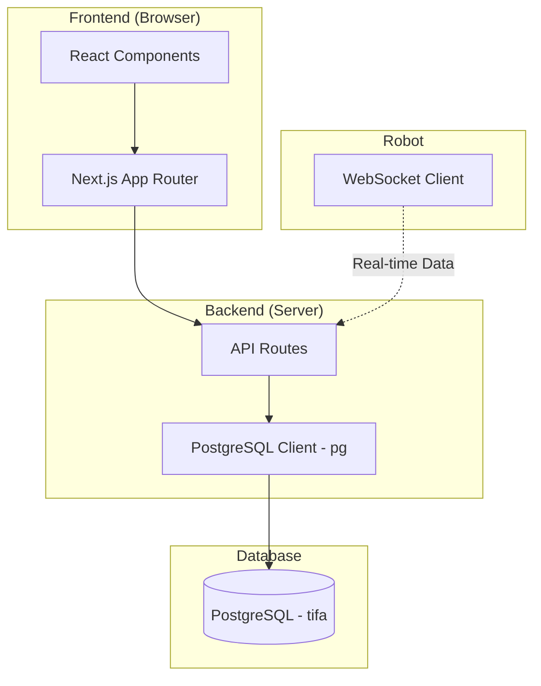

# TIFA Dashboard - Technical Overview

> Sistem monitoring dan manajemen robot TIFA berbasis web

---

## 🏗️ Arsitektur Sistem



---

## 🛠️ Technology Stack

| Layer | Teknologi | Versi |
|-------|-----------|-------|
| **Framework** | Next.js | 16.0.10 |
| **UI Library** | React | 19.2.1 |
| **Language** | TypeScript | 5.x |
| **Styling** | TailwindCSS | 4.x |
| **Database** | PostgreSQL | - |
| **DB Client** | pg (node-postgres) | 8.16.3 |
| **Auth** | Custom (PostgreSQL) | - |

---

## 📁 Struktur Proyek

```
tifa-dashboard/
├── app/                          # Next.js App Router
│   ├── (auth)/                   # Halaman autentikasi
│   │   ├── login/               # Login page
│   │   └── register/            # Register page
│   ├── (dashboard)/             # Protected dashboard pages
│   │   ├── dashboard/           # Overview dashboard
│   │   ├── robots/              # Robot management
│   │   ├── notifications/       # System notifications
│   │   ├── settings/            # User settings
│   │   └── account/             # Account management
│   ├── api/                     # Backend API Routes
│   │   ├── auth/                # Authentication
│   │   ├── battery/             # Battery data
│   │   ├── commands/            # Robot commands
│   │   ├── dashboard/           # Dashboard stats
│   │   ├── device-status/       # Device status
│   │   ├── goals/               # Goal queue
│   │   ├── maps/                # Map management
│   │   ├── notifications/       # Notifications
│   │   ├── position/            # Robot position
│   │   ├── robots/              # Robot CRUD
│   │   └── state/               # Robot state
│   ├── tifa/                    # TIFA landing page
│   └── page.tsx                 # Forgix landing page
├── components/                   # Reusable React Components
│   ├── ForgixNavbar.tsx         # Forgix navbar
│   ├── Navbar.tsx               # Dashboard navbar
│   ├── RobotSelectorModal.tsx   # Robot selector
│   ├── NotificationBell.tsx     # Notification system
│   ├── UserDropdown.tsx         # User menu
│   ├── LogoutConfirmDialog.tsx  # Logout confirmation
│   ├── LanguageSwitcher.tsx     # Language toggle
│   ├── ThemeSwitcher.tsx        # Theme toggle
│   └── ...
├── lib/
│   ├── api/                     # Server-side API functions
│   │   ├── auth.ts              # Authentication logic
│   │   ├── robots.ts            # Robot operations
│   │   ├── battery.ts           # Battery data
│   │   ├── dashboard.ts         # Dashboard stats
│   │   ├── deviceStatus.ts      # Device status
│   │   ├── notifications.ts     # Notifications
│   │   ├── activityLog.ts       # Activity log + sentiment
│   │   └── ...
│   ├── types/                   # TypeScript definitions
│   │   └── database.ts          # DB model types
│   ├── utils/                   # Utility functions
│   │   └── robotGrouping.ts     # Robot grouping logic
│   ├── dbClient.ts              # PostgreSQL connection pool
│   ├── client-api.ts            # Frontend API client
│   ├── dictionaries.ts          # i18n translations
│   ├── dictionaries-tifa.ts     # TIFA page translations
│   └── dictionaries-forgix.ts   # Forgix page translations
└── public/                       # Static assets
```

---

## 🔌 Protokol & Komunikasi

| Protokol | Kegunaan |
|----------|----------|
| **HTTP/REST** | API komunikasi client-server |
| **WebSocket** | Real-time data dari robot |
| **SQL** | Query database PostgreSQL |

---

## 📊 Fitur Utama

### 1. Dashboard Monitoring
- Statistik fleet robot secara real-time
- Status baterai dengan kategori (critical/warning/healthy)
- Mode operasi dan aktivitas robot
- Grafik penggunaan robot per jam

### 2. Manajemen Robot
- Daftar robot dengan status online/offline
- Grouping robot (RB + UI_TIFA_ sebagai satu unit)
- CRUD operations untuk robot
- Per-robot monitoring dengan selector modal

### 3. Sistem Notifikasi
- Alert baterai rendah (< 20%)
- Notifikasi error sistem
- Push notifications dengan badge counter

### 4. Activity Log
- Log aktivitas robot (delivery, interaction, system)
- Sentiment analysis untuk feedback pelanggan
- Filter berdasarkan tipe dan robot

### 5. Autentikasi & User Management
- Login/Register dengan Custom Auth (PostgreSQL)
- Role-based access (admin/operator)
- Account management
- Logout confirmation dialog

### 6. Internasionalisasi
- Indonesian & English support
- Language switcher di navbar

### 7. Theme Support
- Light/Dark mode
- Theme switcher component

---

## 🗄️ Skema Database

| Prefix | Keterangan | Contoh Tabel |
|--------|------------|--------------|
| `m_` | Master Data | `m_device`, `m_company`, `m_map`, `m_goal` |
| `h_` | History/Logs | `h_battery`, `h_position`, `h_state`, `h_command_log` |
| `t_` | Transactions | `t_user`, `t_goal_queue`, `t_settings` |
| `v_` | Views | `v_device_status` |

### Tipe Data Penting

```typescript
// Robot modes
type RobotMode = 'IDLE' | 'MOVING' | 'CHARGING' | 'MAPPING' | 'RETURNING_HOME' | 'ERROR' | 'PAUSED';

// Goal queue status
type GoalQueueStatus = 'QUEUED' | 'IN_PROGRESS' | 'DONE' | 'FAILED' | 'CANCELLED';

// Goal types
type GoalType = 'TABLE' | 'CHARGE' | 'HOME' | 'CUSTOM';

// Sentiment types (for activity log)
type SentimentType = 'positive' | 'negative' | 'neutral';
```

---

## 🌐 API Endpoints

| Endpoint | Method | Deskripsi |
|----------|--------|-----------|
| `/api/auth` | POST | Login & Register |
| `/api/robots` | GET/POST/PUT/DELETE | CRUD robot |
| `/api/robots/grouped` | GET | Grouped robots (RB + UI_TIFA) |
| `/api/battery` | GET | Data baterai |
| `/api/dashboard` | GET | Stats dashboard |
| `/api/device-status` | GET | Status perangkat |
| `/api/notifications` | GET | Notifikasi sistem |
| `/api/position` | GET | Posisi robot |
| `/api/state` | GET | State robot |
| `/api/commands` | GET/POST | Command log |
| `/api/goals` | GET | Goal queue |
| `/api/maps` | GET | Daftar peta |

---

## 🎯 Alur Data

1. **Robot** → Mengirim data via WebSocket ke server
2. **Backend** → Menyimpan ke PostgreSQL (h_battery, h_position, h_state)
3. **API Routes** → Query data dari PostgreSQL
4. **Frontend** → Fetch via API dan render di dashboard
5. **User** → Melihat dan berinteraksi dengan data real-time

---

## ⚡ Quick Commands

```bash
# Development
npm run dev

# Production Build
npm run build

# Start Production
npm start

# Lint
npm run lint
```

---

## 🔧 Environment Variables

```env
DB_HOST=localhost
DB_PORT=5002
DB_NAME=tifa
DB_USER=tifa
DB_PASS=TifaBot2025@
```

> ⚠️ **Pre-requisite:** Jalankan Cloudflare tunnel di terminal terpisah sebelum start app:
> ```
> cloudflared access tcp --hostname postgres.forgixrobotic.com --url localhost:5002
> ```

---

## 📦 Dependencies

### Production
- `next` - React framework
- `react` & `react-dom` - UI library
- `pg` - PostgreSQL client

### Development
- `typescript` - Type checking
- `tailwindcss` - CSS framework
- `eslint` - Code linting
- `@types/*` - Type definitions
